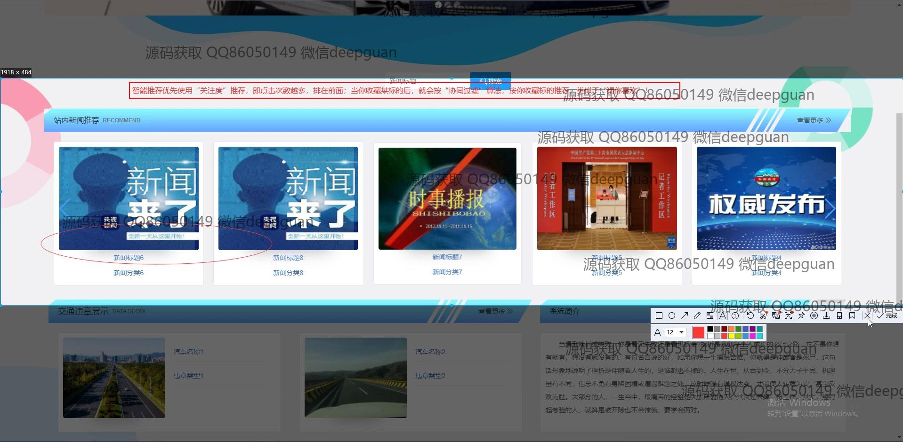
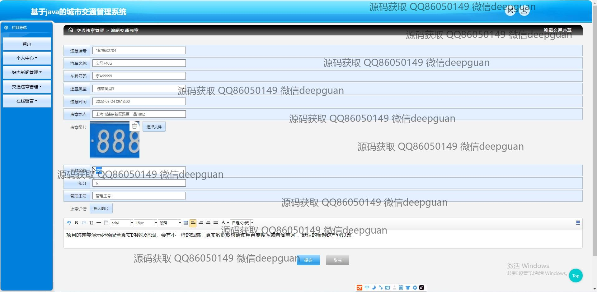

<h1 align="center">基于java的城市交通管理系统</h1>

## 简介
城市交通管理系统：角色分为管理员、用户，功能包括实时交通监控、违章管理、用户注册与管理、新闻发布与编辑、在线留言和数据分析。    --计算机毕业设计源码；毕设源码；java毕业设计源码

## 联系方式

<h3 align="center">获取完整代码与数据库文件 + 微信：deepguan QQ: 86050149 QQ群: 783742310</h3>

<h3 align="center">可帮忙远程部署 包运行成功！提供远程部署、修改代码、设计文档指导、代码讲解等服务！</h3>

## 功能介绍（完整见运行截图）
管理员：用户管理：查看、添加、修改、删除用户信息。交通管理：查看、处理交通违章信息，管理交通公告和新闻。系统管理：角色分配，登录验证，密码管理，系统设置。新闻管理：发布、编辑、分类新闻内容，审核用户留言和反馈。数据分析：交通流量统计，高峰时段分析，违章数据汇总。

用户：基本功能：注册、登录、退出。交通查询：实时交通状况查看，最优路线规划，事故上报。个人中心：查看与修改个人信息，管理车辆信息，查看历史违章记录。意见反馈：在线留言、上传图片，查看留言回应。交通新闻：浏览交通新闻和公告，按分类查看相关新闻。

## 运行截图

本代码来源于网络,仅供学习参考使用!

